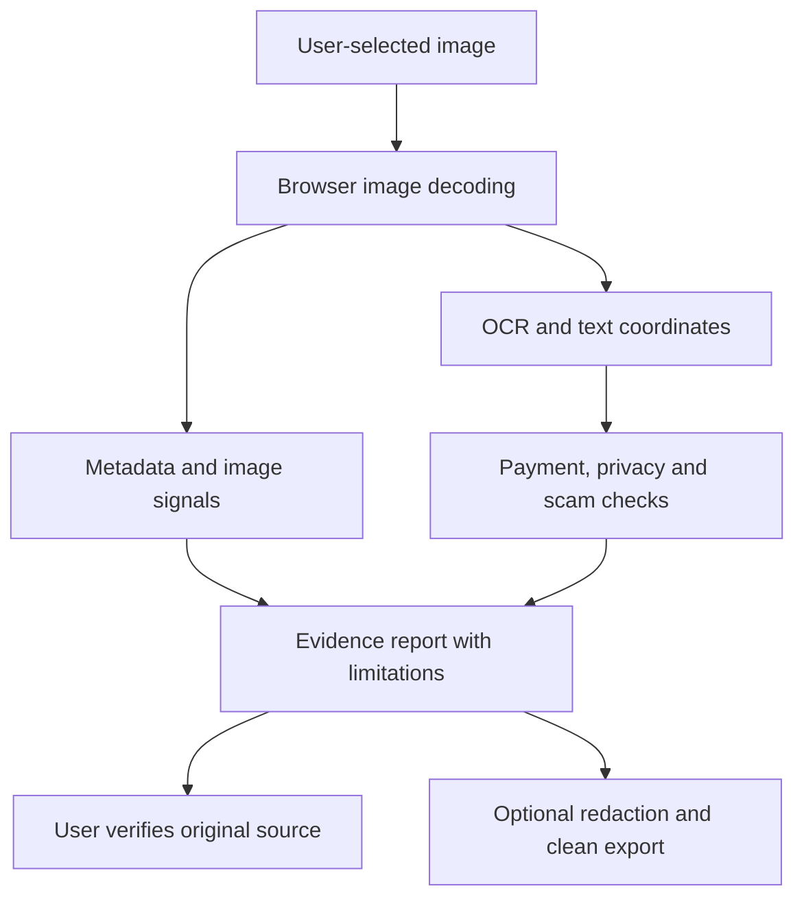

# ScreenshotChecker

ScreenshotChecker is a browser-based digital-safety toolkit for reviewing screenshots, UPI/payment receipts and images. It combines OCR, metadata inspection, manipulation indicators, scam and link signals, and privacy redaction. Reports support investigation; they do not prove image authenticity or confirm payment settlement.

- Live prototype: https://screenshotchecker.com
- Repository: https://github.com/viratchauhan/screenshotchecker
- Hack for Social Cause team: Team CyberSuraksha, HSC|UP|00001
- Developer: Virat Chauhan, sole team member

## Local setup

The repository specifies Node.js 26.9.0 in `.nvmrc`, Node >=22.12.0 in `package.json`, and npm 11.19.1 as the package manager. Prefer the repository-pinned versions.

```sh
git clone https://github.com/viratchauhan/screenshotchecker.git
cd screenshotchecker
npm ci
npm run dev
```

Open the local address printed by Astro. To generate a static build, run `npm run build`. To preview it, run `npm run preview`. `npm run deploy` performs a Cloudflare deployment and should only be used intentionally by the owner.

## Technology and architecture

Astro, TypeScript and Tailwind CSS provide the web interface. Tesseract.js performs OCR; ExifReader inspects metadata; browser Canvas supports pixel processing; the repository integrates a C2PA library for content credentials.

See [Technical Design and Evidence](docs/Technical-Design.pdf) for the implementation map, data flow, reproduction guidance, testing scope and submission evidence.



The dedicated payment pipeline is `src/lib/paymentAnalyzer/paymentPipeline.ts`. Its stages load the current image, perform OCR, classify the receipt, extract entities, evaluate consistency signals and assemble a report. Image and OCR modules live under `src/lib/analyzer`; redaction and report helpers are under `src/lib/utils`.

## Environment variables and privacy boundaries

Core browser image analysis does not require a cloud AI API key. OCR assets may need an initial network download. A browser-local image workflow must not be confused with optional external URL services or reverse-image-search providers.

Optional server-side link-reputation adapters reference the following environment variables:

| Adapter | Variables in source |
| --- | --- |
| VirusTotal | `VT_API_KEY` or `VIRUSTOTAL_API_KEY` |
| Google Web Risk | `GOOGLE_WEB_RISK_API_KEY`, `GOOGLE_SAFE_BROWSING_API_KEY` or `GOOGLE_API_KEY` |
| URLhaus | `URLHAUS_API_KEY` or `ABUSE_CH_API_KEY`; `URLHAUS_DISABLE=true` disables the adapter |

The checked Astro configuration builds a static site. Adapter source alone does not establish that a hosted server endpoint is active. Do not put service secrets in client code. Separately document any deployed external service and the data it receives.

## Samples and tests

- Sample generation: `src/lib/samples/sampleData.ts`
- Reference data: `src/data/fraud_sms_whatsapp_reference_dataset.txt`
- Payment tests: `src/lib/paymentAnalyzer/__tests__/paymentAnalyzer.test.ts`
- OCR tests: `src/lib/analyzer/__tests__/ocrCoordinates.test.ts`
- Metadata and report safety: `src/lib/utils/__tests__`

```sh
npm test
npm run test:ocr
npm run test:metadata
npm run test:reports
npm run check
```

`npm test` discovers test entry points through `scripts/run-tests.mjs`; `npm run check` runs tests and a build. The submission preparation inspected these tests but did not rerun the full suite. Existing logs are not an independent accuracy benchmark.

For a manual demo, open the homepage and select a built-in sample. Review extracted text and uncertainty, then verify a real payment directly in the recipient's official bank/payment app. Use synthetic examples for public demonstrations.

## Evidence and limitations

On 28 September 2026, the built-in PhonePe example in the integrated homepage report returned `INSUFFICIENT_EVIDENCE` and extracted 284 characters. This is one observed example, not a detection-rate estimate.

The owner-authorised Search Console report displayed 67 clicks, 1.65k impressions, 4.1% CTR and average position 32, with the three-month Web filter selected and chart dates 22 August to 25 September 2026. These are search metrics, not unique users, successful analyses or fraud prevented.

Compression, cropping, low resolution and missing metadata can obscure or imitate editing signals. No-match results do not establish safety. A screenshot cannot verify settled funds. Planned validation should use labelled samples, measure false alarms and missed signals, and test low-end devices and accessibility.

## AI assistance

The developer reports limited AI assistance and ChatGPT use for grammar correction. Competition submission writing and the narrated demonstration video were prepared with AI assistance. The code includes local rule/heuristic-based investigation; no claim of a trained general-purpose fraud-detection model is made here.

## License

Project code is released under the [MIT License](LICENSE), selected by the owner. Third-party code and datasets retain their own rights and license terms; the project license does not relicense material owned by others.
